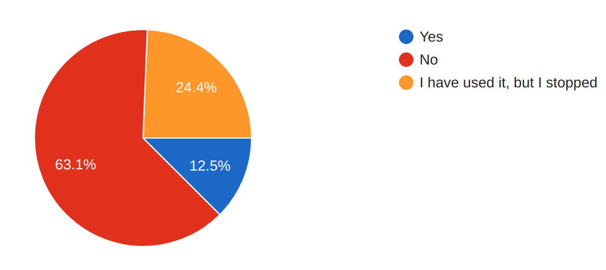
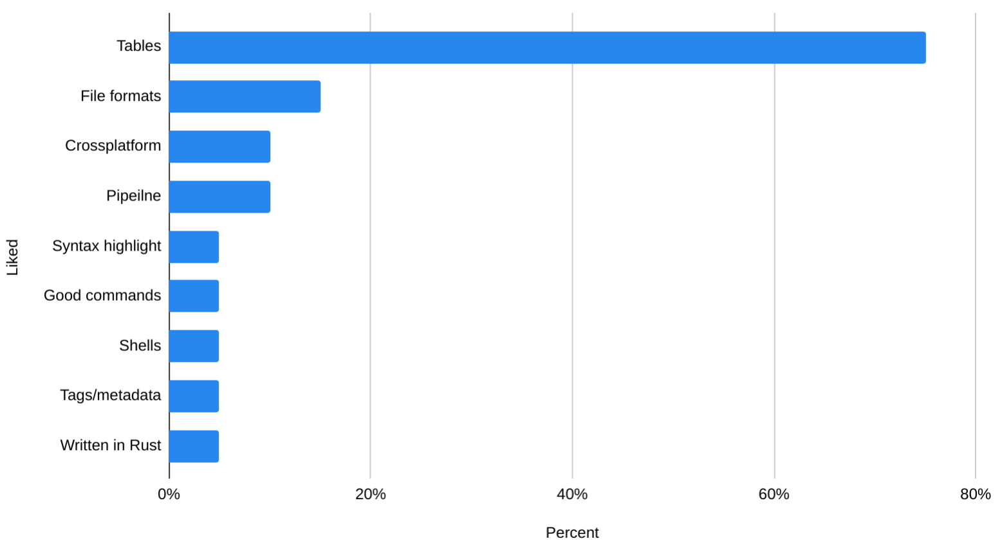
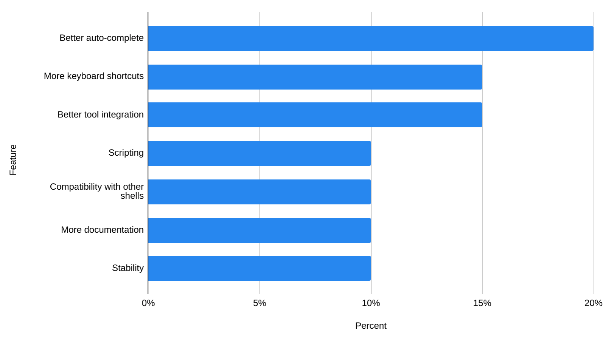
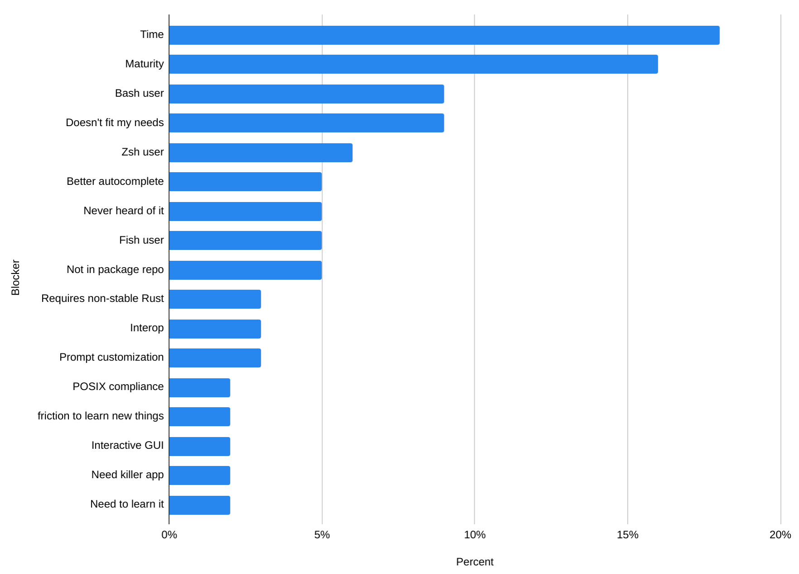
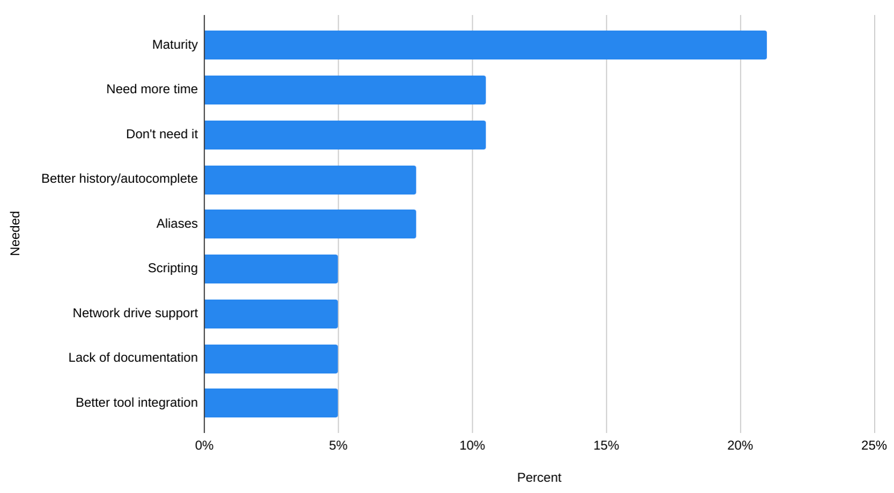
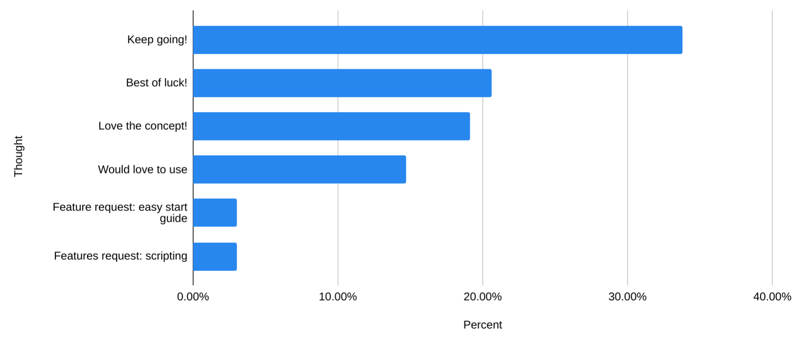

# Nushell 2019 Survey Results

Recently, we ran a short survey to see how you were feeling about [Nushell](https://github.com/nushell/nushell). We wanted to give a very hearty "thank you!" to everyone who participated. These surveys are a great way to gather information about how people are feeling, where they're happy, and where they feel there are pain points.

In total, **160** people responded. An impressive amount for a project still in its first few months in the public.

# Do you use Nu?

The survey welcomed both users and non-users of Nu. In our first question, we wanted to see how many folks are using Nu already. Perhaps unsurprising for a project still missing major functionality, most respondents aren't users, yet. As we'll see, there are themes around what people are waiting for before they jump in.

But first, let's take a look at the responses from folks how are currently using Nu.

# Nu users

## What do you like? (20 responses)

Overwhelmingly, Nu users love tables! People currently using Nushell felt that tables and Nu's structured approach were their favorite features.

People also enjoyed the rich support for different file formats that Nu ships with as well as its focus on being cross-platform.

Other topics mentioned: syntax highlighting, good plugins, shells feature, tags feature, and that it is written in Rust.

### Quotes
* _"The structured data handling is awesome!"_
* _"Tables! \o/"_
* _"It makes it easier to work with data on the command line. I especially love that it's cross-platform."_

## Where should Nushell improve? (20 responses)

Nu users also pointed out a few areas where they hoped Nu would improve over time. Top of mind were improvements around auto-completion, improving the keyboard shortcuts, and better integration with existing shells and tools.

There were also a batch of additional improvements people wished for: full scripting support, better examples/documentation, improved stability, interactive table viewing, more commands, smarter table drawing, better coloring, better error messages, aliases, prompt customization, and general performance improvements.

### Quotes
* _"Better documentation for how to write custom wrappers around existing tools."_
* _"The coloring and autocomplete and a scripting language"_
* _"Compatibility with other shells. It's annoying that I often have to add quotes when copying a command from a website."_
* _"Honestly, I wish I knew enough about Nu that I could add a bunch of documentation to show others what it could do."_

# Nu non-users

## What's stopping you from using Nu? (100 responses)

We also asked for feedback from people not using Nu what their thoughts were. What are the kinds of things that block them from using Nu?

Top of the list are "time" and "maturity". Many people mentioned that it takes time to learn a new system, and time is a precious resource (don't we know it!). Maturity also came up for a lot of folks - if it's not mature yet, the time investment might go to waste. In general, there was a sense of waiting until things are further along before jumping in.

We also heard from many people who were perfectly comfortable in their current shells, whether it be zsh, bash, or fish. For these responders, Nu doesn't offer a compelling reason to switch, yet.

### Quotes
* _"I'm very invested in bash already, but I love the concept and the work being done."_
* _"Too comfy with the current shell, also I am lazy, but the project is awesome"_
* _"I don’t transform data in the shell much, so the core value proposition of nu shell doesn’t resonate well with me."_
* _"I know a lot about traditional shells and don't want to re-learn how to do all that in nushell"_

## Used Nu but stopped (38 responses)

For those folks who tried Nu, but decided it wasn't for them, we also gave them a chance to tell us why. Similarly to the previous question, "stability" and "time" were at the top of the list.

Digging in a bit further, it's not only that Nu itself is changing, but that the package ecosystem hadn't stayed up-to-date with Nu's releases, or didn't yet offer a package. This meant it was easy to not be able to keep up, even if they had time to.

Other topics that came up: needing better autocomplete, needing aliases, better scripting, support for Windows network drives, and improved documentation.

### Quotes
* _"It was interesting, but I have a pretty significant ecosystem built around my flows in Bash and Zsh I can't give up just yet. Maybe that's just something I need to work with."_
* _"Also the lack of documentation around the different commands is a major impediment."_
* _"Lack of middle-of-the-word completion, mostly. Also all the aliases I have defined that I’d need to port over."_

# Anything else we should know? (68 responses)

As our final question, we gave responders a chance to give us any last thoughts they felt we should know.

Overwhelming, people sent us love and encouragement. Lots of it. We wanted to take a moment to appreciate everyone who sent us kind notes to keep going, that they loved what we were building and were excited to try it in the future, and how much they loved the concept.  Thank you! We're excited to keep going, and it feels great to hear from people who are enthusiastic about the project.

### Quotes
* _"Keep going! Will definitely give Nu a try when it's more mature."_
* _"I love how much effort is being put into communication and evolution of the tool."_
* _"It is an interesting and worthwhile take on the command line environment."_
* _"It's a great project, I wanna use it as my daily driver"_
* _"I'm super super duper excited to use this shell"_
* _"I think NuShell is an awesome project. Thanks for doing this"_

And thank *you* for responding to our survey!

# Conclusions

The astute reader may already see some of the changes we've done recently were directly inspired by comments in this survey, and more are planned. This has been a great help, and we're looking forward to growing Nu with you in the coming months.

As always, feel free to come by our [discord](https://discord.gg/NtAbbGn), say hi on [twitter](https://twitter.com/nu_shell), or drop us a note in our [github](https://github.com/nushell/nushell).
